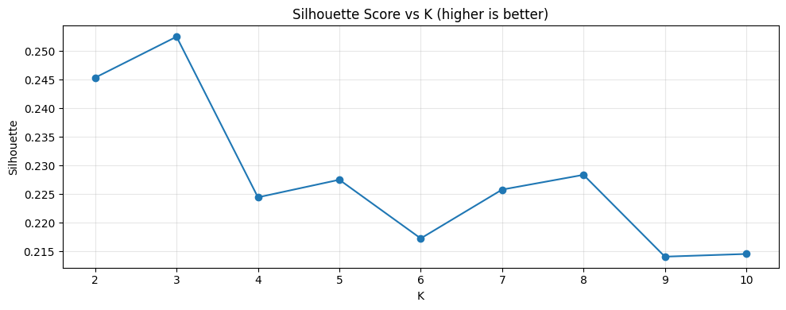
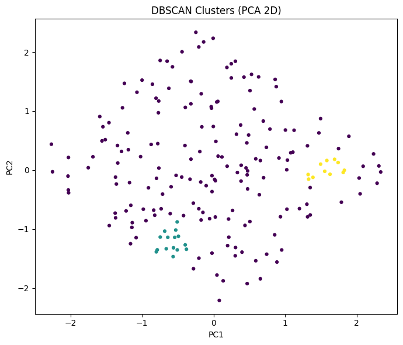
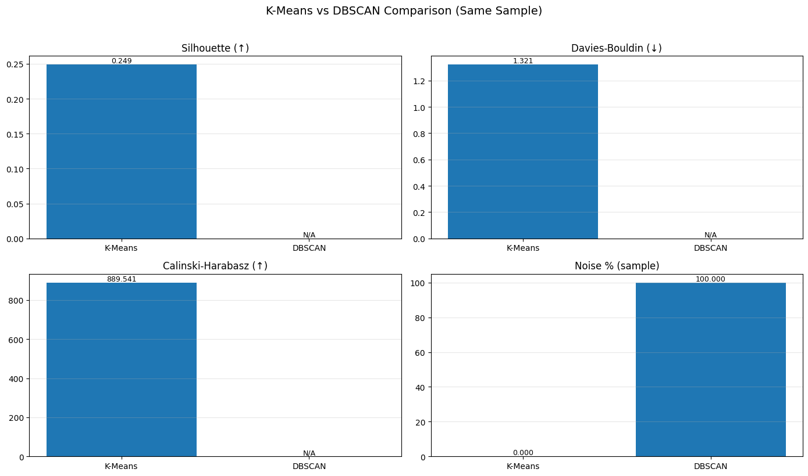

# Machine Failure Clustering Analysis

## Overview
This project applies unsupervised machine learning techniques to identify machine failure patterns using clustering algorithms.

## Tools & Technologies
- Python
- Pandas
- NumPy
- Scikit-learn
- Matplotlib
- PCA
- K-Means
- DBSCAN

## Project Workflow
1. Data Cleaning
2. Missing Values Handling
3. Outlier Detection
4. Feature Scaling
5. PCA Visualization
6. K-Means Clustering
7. DBSCAN Clustering
8. Model Evaluation

## Results

### Choosing the Optimal Number of Clusters

### K-Means Clustering Result

### K-Means vs DBSCAN Comparison

## Key Findings
- K-Means achieved the best clustering performance.
- Optimal number of clusters was selected using clustering evaluation metrics.
- DBSCAN identified excessive noise and produced weaker clustering results on this dataset.

## Files

- [Notebook](final_clustering_notebook.ipynb)
- [Dataset](dirty_machine_data.csv)

## Author
amr khaled
